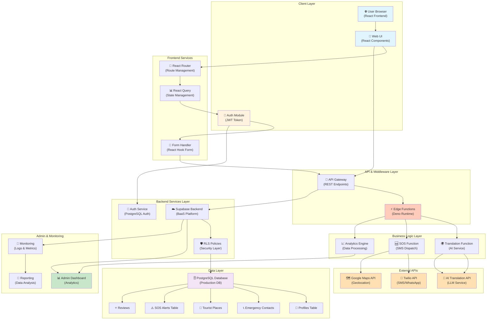
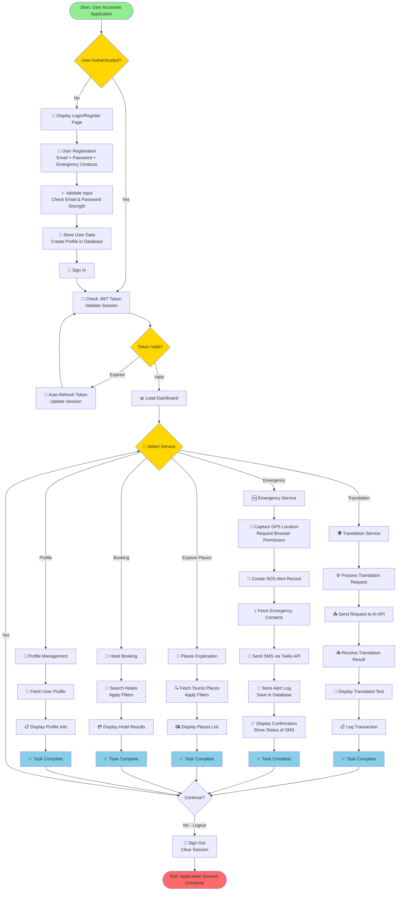

# 11. Description of the Components / Machinery / Process

## 11.1 Software Components Used

### 11.1.1 Frontend Technologies

**Primary Framework:**
- **React**: Version 18.3.1
  - A declarative JavaScript library for building user interfaces with component-based architecture
  - Features: Virtual DOM, reactive state management, lifecycle hooks
  - Used for: Core application UI, page rendering, and interactive components

**Language & Type System:**
- **TypeScript**: Version 5.8.3
  - Superset of JavaScript providing static type checking and enhanced IDE support
  - Configuration: Strict mode enabled with path aliasing (@/* for src/ directory imports)
  - Ensures type safety across the entire frontend codebase

**Build Tool:**
- **Vite**: Version 5.4.19
  - Next-generation frontend build tool providing lightning-fast development server (HMR)
  - Configuration: Development server on port 8080, optimized production bundling
  - Plugin: Vite React SWC plugin for ultra-fast JSX transformation using SWC transpiler
  - Production Build: Transforms 1834+ modules in ~4.85 seconds with zero TypeScript errors

**UI Component Libraries:**
- **Shadcn/UI** + **Radix UI**: Composable, low-level UI primitives
  - Components implemented: Accordion, Alert Dialog, Avatar, Badge, Breadcrumb, Button, Calendar, Card, Carousel, Checkbox, Collapsible, Command, Context Menu, Dialog, Drawer, Dropdown Menu, Form, Hover Card, Input, Label, Menubar, Navigation Menu, Pagination, Popover, Progress, Radio Group, Resizable, Scroll Area, Select, Separator, Sheet, Slider, Switch, Tabs, Toast, Toggle, Tooltip
  - Accessibility: Full WCAG 2.1 compliance with keyboard navigation and screen reader support
  - Styling: Unstyled, fully customizable with Tailwind CSS

**CSS Framework:**
- **Tailwind CSS**: Version 3.4.17
  - Utility-first CSS framework for rapid UI development
  - Configuration: Custom color system, extended border-radius, responsive design, dark mode support
  - Plugins: @tailwindcss/typography for rich text styling, tailwindcss-animate for animations
  - Preprocessing: PostCSS with Autoprefixer for cross-browser compatibility

**Routing & Navigation:**
- **React Router DOM**: Version 6.30.1
  - Client-side routing without full page reloads
  - Route Structure:
    ```
    / - Home/Index page
    /auth - Authentication (Sign up/Sign in)
    /places - Tourist places listing and exploration
    /places/:id - Individual place detail page
    /hotels - Hotel booking and search
    /translator - AI-powered multilingual voice translator
    /ar-scanner - Augmented Reality monument scanner
    /ar-scan-result - AR scan results display
    /tracking - GPS real-time location tracking
    /reviews - Travel reviews and testimonials
    /profile - User profile management
    /* - 404 Not Found page
    ```

**State Management & Data Fetching:**
- **TanStack React Query**: Version 5.83.0
  - Server state management library for efficient data synchronization
  - Features: Automatic caching, background synchronization, request deduplication
  - Used for: Managing API responses from Supabase

**Form Handling:**
- **React Hook Form**: Version 7.61.1
  - Performance-optimized form state management
  - Integration: @hookform/resolvers for schema validation
  - Used alongside Zod for form validation

**Schema Validation:**
- **Zod**: Version 3.25.76
  - TypeScript-first schema declaration and validation
  - Used for: Form input validation, API response typing, runtime type checking

**Date & Time Handling:**
- **date-fns**: Version 3.6.0
  - Minimal, modular JavaScript date utility library
  - Used for: Calendar operations, timestamp formatting, timezone handling

**User Interaction & Notifications:**
- **Sonner**: Version 1.7.4
  - Toast notification system for user feedback
  - Features: Customizable messages, auto-dismiss, stacking notifications

- **Radix UI Toast**: Version 1.2.14
  - Low-level toast primitive component

- **Vaul**: Version 0.9.9
  - Drawer component for mobile navigation and menus

**Data Visualization:**
- **Recharts**: Version 2.15.4
  - Composable React charting library built on D3
  - Used for: Analytics, tracking statistics, data representation

**Carousel/Slideshow:**
- **Embla Carousel React**: Version 8.6.0
  - Carousel component library for image and content sliders
  - Features: Touch support, responsive behavior, keyboard navigation

**Icon System:**
- **Lucide React**: Version 0.462.0
  - 460+ pixel-perfect SVG icons
  - Used for: Navigation icons, action icons, status indicators

**UI Utilities:**
- **clsx**: Version 2.1.1
  - Utility for constructing className strings conditionally

- **tailwind-merge**: Version 2.6.0
  - Merges Tailwind CSS classes intelligently to avoid conflicts

- **input-otp**: Version 1.4.2
  - OTP input component for authentication flows

**Theme Management:**
- **next-themes**: Version 0.3.0
  - Dark mode and theme switching system
  - Persistence: LocalStorage-based theme preference

**Mobile Detection:**
- **use-mobile**: Custom hook for responsive design based on viewport width

### 11.1.2 Backend Technologies

**Backend-as-a-Service Platform:**
- **Supabase**: Version 2.87.1
  - Open-source Firebase alternative providing:
    - PostgreSQL database hosting
    - Built-in authentication and authorization
    - Real-time database subscriptions
    - Edge Functions (Serverless Deno runtime)
    - Row-Level Security (RLS) policies for data protection
  - Project ID: `oramdepdnxzcrrhinifm`
  - Connection: Vite environment variables for secure credential management

**Database Management:**
- **PostgreSQL** (via Supabase)
  - Relational database management system
  - Features: ACID compliance, JSON support, UUID primary keys, triggers for automation
  - Tables & Schemas:
    
    **1. profiles Table**
    ```sql
    - id (UUID, Primary Key)
    - user_id (UUID, Foreign Key → auth.users)
    - full_name (TEXT)
    - phone (TEXT)
    - created_at (TIMESTAMPTZ)
    - updated_at (TIMESTAMPTZ)
    ```
    RLS Policies: Public read, user-restricted insert/update
    
    **2. emergency_contacts Table**
    ```sql
    - id (UUID, Primary Key)
    - user_id (UUID, Foreign Key → auth.users)
    - name (TEXT)
    - phone (TEXT)
    - relationship (TEXT)
    - created_at (TIMESTAMPTZ)
    ```
    RLS Policies: User-managed access control
    
    **3. tourist_places Table**
    ```sql
    - id (UUID, Primary Key)
    - name (TEXT)
    - category (TEXT) - [Heritage, Spiritual, Nature, Wildlife, Adventure, Beach, Hill Station, Monument, City, Cultural, Entertainment]
    - location (TEXT)
    - description (TEXT)
    - history (TEXT)
    - best_time (TEXT)
    - image_url (TEXT)
    - latitude (DECIMAL 10,8)
    - longitude (DECIMAL 11,8)
    - created_at (TIMESTAMPTZ)
    ```
    RLS Policies: Public read access
    
    **4. sos_alerts Table**
    ```sql
    - id (UUID, Primary Key)
    - user_id (UUID, Foreign Key → auth.users)
    - latitude (DECIMAL 10,8)
    - longitude (DECIMAL 11,8)
    - status (TEXT) - [active, responded, resolved]
    - created_at (TIMESTAMPTZ)
    ```
    RLS Policies: User-managed access control

**Authentication:**
- **Supabase Auth** (PostgreSQL-based)
  - Email/Password authentication with secure hashing (bcrypt)
  - JWT token generation and validation
  - Session persistence: LocalStorage with auto-refresh
  - Features:
    - User registration with email verification
    - Password recovery flows
    - Automatic profile creation via trigger function
    - Role-based access control support

**Serverless Functions:**
- **Supabase Edge Functions** (Deno Runtime)
  - Deployment platform: Globally distributed edge network
  - Programming language: TypeScript/Deno
  
  **Function 1: send-sms**
  - Purpose: Send SMS and WhatsApp messages for SOS alerts
  - Runtime: Deno 1.40+
  - Dependencies: Supabase SDK, Twilio SDK
  - Environment Variables:
    - `SUPABASE_URL`: Backend URL
    - `SUPABASE_SERVICE_ROLE_KEY`: Admin authentication key
    - `TWILIO_ACCOUNT_SID`: Twilio account identifier
    - `TWILIO_AUTH_TOKEN`: Twilio authentication token
    - `TWILIO_PHONE_NUMBER`: SMS sender number
    - `TWILIO_WHATSAPP_NUMBER`: WhatsApp-enabled Twilio number
  - Features:
    - Multi-channel alert delivery (SMS + WhatsApp)
    - Phone number formatting validation
    - Error handling and logging
    - Response tracking with message SIDs
  
  **Function 2: translate**
  - Purpose: AI-powered multilingual text translation
  - Runtime: Deno with CORS support
  - Environment Variables:
    - `AI_API_KEY`: Third-party AI service API key (provider-agnostic)
  - Features:
    - Supports language pairs: English, Hindi, Telugu, Tamil, Kannada, Marathi, Bengali
    - Prompt engineering for accurate translations
    - Error handling with detailed logging
  - API Endpoint: `https://api.example-ai.com/v1/chat/completions` (abstracted for flexibility)

### 11.1.3 External APIs & Third-Party Services

**Geolocation & Mapping:**
- **Google Maps API**
  - Integration: Live location link generation
  - URL Format: `https://www.google.com/maps?q={latitude},{longitude}`
  - Used for: Emergency location sharing, place discovery, GPS tracking

**Geolocation Web API:**
- Browser native Geolocation API
  - High accuracy mode enabled
  - Timeout: 10 seconds
  - Maximum age: 0 (fresh position)
  - Permission-based location access

**Communication:**
- **Twilio**: SMS and WhatsApp messaging service
  - SMS: Standard short message service
  - WhatsApp: WhatsApp Business API integration
  - Use case: SOS emergency alerts with location information

**Translation & AI:**
- **GenericAI Service**: Provider-agnostic AI translation
  - Model: LLM-based translation engine
  - Abstracted endpoint design for future provider switching
  - System prompt: Context-aware translation instruction

**Browser APIs (Client-side):**
- **Web Speech API**
  - `webkitSpeechRecognition`: Voice input for multilingual translator
  - `speechSynthesis`: Voice output/TTS functionality
  - Supported languages: Determined by browser implementation
  - Used for: Real-time speech-to-text and text-to-speech conversion

- **Geolocation API**
  - Real-time location tracking with high accuracy
  - Permission-based access model

- **File Reader API**
  - Image file upload and base64 conversion
  - Used in: AR Scanner image processing

### 11.1.4 Environment Variables

**File Location:** `.env` (root directory)

**Configuration Variables:**
```env
VITE_SUPABASE_PROJECT_ID="oramdepdnxzcrrhinifm"
VITE_SUPABASE_PUBLISHABLE_KEY="eyJhbGciOiJIUzI1NiIsInR5cCI6IkpXVCJ9..."
VITE_SUPABASE_URL="https://oramdepdnxzcrrhinifm.supabase.co"
```

**Variable Purposes:**
- `VITE_SUPABASE_PROJECT_ID`: Project identifier for Supabase services
- `VITE_SUPABASE_PUBLISHABLE_KEY`: JWT token for unauthenticated client-side requests (scoped to anonymous role)
- `VITE_SUPABASE_URL`: Base URL for API and real-time subscriptions

**Access Pattern:** `import.meta.env.VITE_*` (Vite's environment variable system)

---

## 11.2 Development Tools

### 11.2.1 Integrated Development Environment

**Primary IDE:**
- **Visual Studio Code** (VS Code)
  - Inferred from: ESLint configuration, TypeScript settings
  - Extensions utilized:
    - TypeScript Language Server for intellisense
    - ESLint for real-time code quality checks
    - Tailwind CSS IntelliSense for utility class suggestions
    - Various UI framework extensions

### 11.2.2 Package Manager

**Package Manager: Bun**
- Version: 1.0+ (indicated by `bun.lockb` lockfile)
- Alternative: npm/yarn compatible
- All dependencies locked in: `bun.lockb` (binary lockfile format)
- Command: `bun install`, `bun run dev`, `bun run build`

**Total Dependencies:** 
- Production: 41 packages
- Development: 14 packages

### 11.2.3 Linting & Code Quality

**ESLint Configuration:**
- Version: 9.32.0
- Config File: `eslint.config.js` (Flat Config format)
- Enabled Plugins:
  - `@eslint/js`: JavaScript linting rules
  - `typescript-eslint`: TypeScript-specific rules
  - `eslint-plugin-react-hooks`: React Hooks best practices
  - `eslint-plugin-react-refresh`: Vite React refresh validation
  - `globals`: Browser and Node globals definitions
- Linting Commands:
  - `bun run lint`: Check code quality
  - Auto-fix available: `eslint . --fix`

### 11.2.4 Version Control

**System: Git**
- Repository structure: Standard monorepo with source in `src/`
- Configuration files: `.gitignore` (inferred)
- Typical workflow: Feature branches, commits, pull requests

### 11.2.5 Build & Development Scripts

**Available Commands** (from `package.json`):
```json
{
  "dev": "vite",                    // Start development server on port 8080
  "build": "vite build",            // Production build (optimized)
  "build:dev": "vite build --mode development",  // Development mode build
  "lint": "eslint .",               // Run ESLint checks
  "preview": "vite preview"         // Preview production build locally
}
```

---

## 11.3 System Specifications & Requirements

### 11.3.1 Operating System Compatibility

**Supported Platforms:**
- Microsoft Windows (10/11, 64-bit)
- Linux (Ubuntu 18.04 LTS or equivalent)
- macOS (10.15 Catalina or newer)

**Justification:** 
- Browser-based architecture (no platform-specific dependencies)
- Cross-platform support provided by Node.js/Bun runtime
- Web technologies are platform-agnostic

### 11.3.2 Hardware Requirements

**Minimum Specifications:**
| Component | Minimum | Recommended |
|-----------|---------|-------------|
| **RAM (Memory)** | 2 GB | 4 GB or higher |
| **Processor** | Dual-core 2.0 GHz | Quad-core 2.4 GHz or better |
| **Storage (Project)** | 300 MB (with node_modules) | 500 MB SSD |
| **Storage (System)** | 1 GB free space | 2 GB free space |
| **Display** | 1024x768 minimum | 1920x1080 or higher |
| **Internet Connection** | Minimum 2 Mbps | 5+ Mbps for optimal experience |

**Detailed Breakdown:**

1. **RAM Requirements:**
   - Node.js/Bun runtime: ~150 MB
   - Vite development server: ~200 MB
   - React application: ~100 MB
   - Browser overhead: ~400-800 MB
   - **Total minimum: 2 GB**

2. **Storage Requirements:**
   - Source code: ~50 MB
   - node_modules directory: ~250 MB (1834+ modules)
   - Build output (dist/): ~2-3 MB

3. **Processor Requirements:**
   - Development: Dual-core sufficient for Bun/Vite
   - Production (client-side): Single-core capable
   - Recommendation: Modern processor for faster builds

4. **Network Specifications:**
   - Real-time database subscriptions (WebSocket)
   - Geolocation API calls
   - External API calls (Twilio, Supabase, AI services)
   - **Minimum: 2 Mbps uplink (for geolocation and SOS alerts)**

### 11.3.3 Software Installation Requirements

**Runtime Environment:**
- **Node.js** OR **Bun** (required for development only, not for production)
  - Minimum: Node.js 18.0.0 (LTS) or Bun 1.0+
  - Recommended: Node.js 20.0.0+ / Bun latest
  - **Production deployments:** Not required (browser-only execution)
  - **Development requirement:** Build new features, run dev server
  
- **Package Manager:**
  - **Bun** (Primary): `bun install`
  - **Alternative:** npm 8.0+ or yarn 3.0+ (compatible)

**System Dependencies:**
- None required on production client machines
- Development-only: git (for version control)

### 11.3.4 Browser Requirements

**Minimum Browser Specifications:**

| Feature | Chrome | Firefox | Safari | Edge |
|---------|--------|---------|--------|------|
| **Minimum Version** | 90+ | 88+ | 14+ | 90+ |
| **ES2020 Support** | ✓ | ✓ | ✓ | ✓ |
| **Web Workers** | ✓ | ✓ | ✓ | ✓ |
| **Web Speech API** | ✓ (partial) | ✗ | ✗ | ✓ (partial) |
| **Geolocation API** | ✓ | ✓ | ✓ | ✓ |
| **LocalStorage** | ✓ | ✓ | ✓ | ✓ |
| **WebGL** | ✓ | ✓ | ✓ | ✓ |

**Required Browser Features:**
1. **JavaScript (ES2020+):** Core language support
2. **CSS Grid & Flexbox:** Modern layout (Tailwind dependency)
3. **CSS Custom Properties:** Theme system
4. **LocalStorage:** Session persistence, preferences
5. **Geolocation API:** GPS tracking, SOS features
6. **Web Speech API:** Voice translator functionality
7. **Fetch API & WebSocket:** Real-time data, API communication
8. **File Reader API:** Image upload for AR Scanner
9. **CSS Animations:** UI transitions (Tailwind CSS animations)

**Recommended Best Practice:**
- Keep browser updated to latest stable version
- Enable JavaScript (required for application functionality)
- Allow geolocation permissions for tracking features
- Enable microphone/speaker access for translator

---

## 11.4 Project Architecture

### 11.4.1 Architectural Overview

**Architecture Style:** Multi-tier Client-Server Architecture with Serverless Backend

```
┌─────────────────────────────────────────────────────────────┐
│                     Client Tier (Browser)                     │
│  ┌──────────────────────────────────────────────────────────┐
│  │  React Frontend (SPA - Single Page Application)          │
│  │  - UI Components (8+ feature pages)                      │
│  │  - State Management (React Query, Local State)           │
│  │  - Routing (React Router v6)                             │
│  │  - Form Validation (React Hook Form + Zod)              │
│  └──────────────────────────────────────────────────────────┘
│                            ↕ (REST API)
├─────────────────────────────────────────────────────────────┤
│                   API & Business Logic Tier                   │
│  ┌──────────────────────────────────────────────────────────┐
│  │  Supabase Edge Functions (Serverless Deno Runtime)      │
│  │  - send-sms: SMS/WhatsApp alert service                 │
│  │  - translate: AI-powered translation service            │
│  └──────────────────────────────────────────────────────────┘
│                     ↕ (SQL Query)
├─────────────────────────────────────────────────────────────┤
│                     Data Persistence Tier                     │
│  ┌──────────────────────────────────────────────────────────┐
│  │  PostgreSQL Database (Supabase)                          │
│  │  - User profiles & authentication                        │
│  │  - Tourist places & metadata                             │
│  │  - Emergency contacts                                    │
│  │  - SOS alerts with geolocation                          │
│  │  - Row-Level Security (RLS) policies                     │
│  └──────────────────────────────────────────────────────────┘
│                            ↕
├─────────────────────────────────────────────────────────────┤
│              External Services Integration Layer               │
│  ┌──────────────────────────────────────────────────────────┐
│  │  Third-Party APIs:                                       │
│  │  - Google Maps API (geolocation & map links)            │
│  │  - Twilio API (SMS/WhatsApp messaging)                  │
│  │  - AI Translation Service (LLM-based)                   │
│  │  - Browser APIs (Geolocation, Speech Recognition)       │
│  └──────────────────────────────────────────────────────────┘
└─────────────────────────────────────────────────────────────┘
```

### 11.4.2 Frontend Architecture

**Component Hierarchy:**

```
App.tsx (Root)
├── Providers
│   ├── QueryClientProvider (TanStack React Query)
│   ├── TooltipProvider (Radix UI)
│   ├── AuthProvider (Custom Context)
│   ├── BrowserRouter (React Router)
│   └── Toast Providers (Radix + Sonner)
│
├── Layout
│   ├── Header (Navigation)
│   └── Footer (if applicable)
│
└── Routes
    ├── / (Index) - Home & Hero Section
    ├── /auth - Authentication (Sign up/Sign in)
    ├── /places - Tourist Places Listing
    ├── /places/:id - Place Detail View
    ├── /hotels - Hotel Booking Interface
    ├── /translator - Voice Translator
    ├── /ar-scanner - AR Monument Scanner
    ├── /ar-scan-result - Scan Results Display
    ├── /tracking - GPS Tracking
    ├── /reviews - Travel Reviews
    ├── /profile - User Profile
    └── /* - 404 Not Found
```

**Folder Structure:**

```
src/
├── components/
│   ├── ui/ (Shadcn/UI + Radix components - 30+ components)
│   │   ├── button.tsx, input.tsx, card.tsx, dialog.tsx, etc.
│   │   └── (Full component library for consistent UI)
│   ├── layout/
│   │   └── Header.tsx (Navigation header)
│   ├── sos/
│   │   └── SOSButton.tsx (Emergency alert button)
│   └── NavLink.tsx (Navigation link wrapper)
│
├── pages/ (Route-level components)
│   ├── Index.tsx (Home page)
│   ├── Auth.tsx (Authentication)
│   ├── Places.tsx (Tourist places listing)
│   ├── PlaceDetail.tsx (Individual place)
│   ├── Hotels.tsx (Hotel search & booking)
│   ├── Translator.tsx (Multilingual translator)
│   ├── ARScanner.tsx (Image upload & scanning)
│   ├── ARScanResult.tsx (Scan results)
│   ├── Tracking.tsx (GPS tracking)
│   ├── Reviews.tsx (User reviews)
│   ├── Profile.tsx (User profile)
│   └── NotFound.tsx (404 page)
│
├── hooks/ (Custom React hooks)
│   ├── useAuth.tsx (Authentication context & logic)
│   ├── useSOS.tsx (SOS functionality & Geolocation)
│   ├── use-toast.ts (Toast notification system)
│   └── use-mobile.tsx (Responsive design helper)
│
├── integrations/ (Third-party integrations)
│   └── supabase/
│       ├── client.ts (Supabase client initialization)
│       └── types.ts (Auto-generated TypeScript types)
│
├── lib/ (Utilities & business logic)
│   ├── imageRecognition.ts (AR Scanner algorithm)
│   ├── tourist-data.ts (Tourist places dataset - 100+ places)
│   ├── emergencyContactsService.ts (Emergency contact management)
│   └── utils.ts (General utilities - cn() function)
│
├── App.tsx (Root component & routing)
├── main.tsx (Application entry point)
├── index.css (Global styles)
└── App.css (App-specific styles)
```

### 11.4.3 Backend Architecture

**Supabase Service Integration:**

```
Frontend (src/integrations/supabase/client.ts)
    ↓
Supabase Client SDK (@supabase/supabase-js@2.87.1)
    ├─ Authentication Layer
    │  └─ JWT Token Management (localStorage persistence)
    │
    ├─ Real-time Database Layer
    │  ├─ PostgreSQL connection
    │  └─ WebSocket subscriptions
    │
    ├─ REST API Layer
    │  ├─ CRUD operations on tables
    │  └─ Row-Level Security enforcement
    │
    └─ Edge Functions Layer
       ├─ send-sms function
       └─ translate function
```

**Authentication Flow:**

```
1. User Registration (Sign Up)
   User Form → Auth.tsx → useAuth.signUp() 
   → supabase.auth.signUp(email, password)
   → PostgreSQL: INSERT profiles (trigger activation)
   → SET emergency_contacts
   → Redirect to home

2. User Login (Sign In)
   User Form → Auth.tsx → useAuth.signIn()
   → supabase.auth.signInWithPassword()
   → JWT token generated
   → LocalStorage: session persistence
   → AuthProvider: useAuth context updated
   → Protected routes accessible

3. Session Management
   AuthProvider (useAuth.tsx)
   ├─ Monitor auth state changes (onAuthStateChange)
   ├─ Auto-refresh tokens (enabled in client config)
   ├─ Persist session in localStorage
   └─ Provide user context to entire app
```

### 11.4.4 Data Communication Flow

**API Communication Pattern:**

```
Frontend Component
    ↓
React Hook (useQuery, useMutation from React Query)
    ↓
Supabase Client Method
    ├─ supabase.from('table_name').select()
    ├─ supabase.from('table_name').insert()
    ├─ supabase.from('table_name').update()
    └─ supabase.functions.invoke('function_name')
    ↓
Supabase REST API Endpoint
    ↓
Row-Level Security Check (RLS Policies)
    ↓
PostgreSQL Query Execution
    ↓
Server Response (JSON)
    ↓
React Query Cache & State Update
    ↓
Component Re-render
```

**Request Example: Fetch Tourist Places**

```typescript
// In Places.tsx component
const { data: places, isLoading } = useQuery({
  queryKey: ['tourist-places', category, state],
  queryFn: async () => {
    const { data, error } = await supabase
      .from('tourist_places')
      .select('*')
      .eq('category', category === 'all' ? undefined : category)
      .eq('state', state === 'All States' ? undefined : state);
    
    if (error) throw error;
    return data;
  }
});

// Response: Array of TouristPlace objects
```

**WebSocket Real-time Subscriptions:**

```typescript
// SOS tracking real-time updates
supabase
  .from('sos_alerts')
  .on('*', payload => {
    // Update UI with alert status changes
    console.log('Alert status:', payload.new.status);
  })
  .subscribe();
```

### 11.4.5 Database Architecture & Relationships

**Entity-Relationship Diagram (Logical):**

```
┌─────────────────────────┐
│     auth.users          │ (Supabase Auth Table)
│  (PostgreSQL Auth)      │
│  ───────────────────    │
│  - id (UUID, PK)        │
│  - email (unique)       │
│  - password_hash        │
│  - created_at           │
└────────────┬────────────┘
             │ (1:1 relationship)
             │ Foreign Key: user_id
             ↓
┌─────────────────────────────────────┐
│   public.profiles                   │
│  ───────────────────────────────────│
│  - id (UUID, PK)                    │
│  - user_id (UUID, FK → auth.users)  │
│  - full_name (TEXT)                 │
│  - phone (TEXT)                     │
│  - created_at (TIMESTAMPTZ)         │
│  - updated_at (TIMESTAMPTZ)         │
│ RLS: Public read, User-restricted   │
│      insert/update                  │
└────────╦──────────────────────────┬─┘
         │                          │
         │ (1:N)                    │ (1:N)
         │                          ↓
         │              ┌──────────────────────────┐
         │              │ public.emergency_       │
         │              │ contacts                │
         │              │──────────────────────────│
         │              │ - id (UUID, PK)         │
         │              │ - user_id (UUID, FK)    │
         │              │ - name (TEXT)           │
         │              │ - phone (TEXT)          │
         │              │ - relationship (TEXT)   │
         │              │ - created_at            │
         │              │ RLS: User-managed       │
         │              └──────────────────────────┘
         │
         │ (1:N)
         ↓
┌──────────────────────────────────┐
│   public.sos_alerts              │
│  ────────────────────────────────│
│  - id (UUID, PK)                 │
│  - user_id (UUID, FK)            │
│  - latitude (DECIMAL 10,8)       │
│  - longitude (DECIMAL 11,8)      │
│  - status (TEXT)                 │
│  - created_at (TIMESTAMPTZ)      │
│  RLS: User-managed access        │
└──────────────────────────────────┘

┌──────────────────────────────────┐
│ public.tourist_places            │
│ (Shared resource - no FK)        │
│  ────────────────────────────────│
│  - id (UUID, PK)                 │
│  - name (TEXT)                   │
│  - category (TEXT)               │
│  - location (TEXT)               │
│  - state (TEXT)                  │
│  - description (TEXT)            │
│  - history (TEXT)                │
│  - best_time (TEXT)              │
│  - image_url (TEXT)              │
│  - latitude (DECIMAL 10,8)       │
│  - longitude (DECIMAL 11,8)      │
│  - created_at (TIMESTAMPTZ)      │
│  RLS: Public read access         │
└──────────────────────────────────┘
```

**Row-Level Security (RLS) Policies:**

```sql
-- Profiles Table: Public can read all, users can modify their own
CREATE POLICY "Profiles public read" ON profiles FOR SELECT USING (true);
CREATE POLICY "Users insert own profile" ON profiles FOR INSERT 
  WITH CHECK (auth.uid() = user_id);
CREATE POLICY "Users update own profile" ON profiles FOR UPDATE 
  USING (auth.uid() = user_id);

-- Emergency Contacts: Users manage only their own
CREATE POLICY "Users manage own emergency contacts" ON emergency_contacts 
  FOR ALL USING (auth.uid() = user_id) 
  WITH CHECK (auth.uid() = user_id);

-- Tourist Places: Public read-only access
CREATE POLICY "Public can view tourist places" ON tourist_places 
  FOR SELECT USING (true);

-- SOS Alerts: Users manage only their own alerts
CREATE POLICY "Users manage own SOS alerts" ON sos_alerts 
  FOR ALL USING (auth.uid() = user_id) 
  WITH CHECK (auth.uid() = user_id);
```

**Database Triggers:**

```sql
-- Automatic Profile Creation on User Signup
CREATE TRIGGER handle_new_user
AFTER INSERT ON auth.users
FOR EACH ROW EXECUTE FUNCTION handle_new_user();

-- Function Definition
CREATE FUNCTION handle_new_user() RETURNS TRIGGER AS $$
BEGIN
  INSERT INTO public.profiles (user_id)
  VALUES (new.id);
  RETURN new;
END;
$$ LANGUAGE plpgsql SECURITY DEFINER;
```

### 11.4.6 Detailed Feature Architecture

**Feature 1: AR Scanner (Image Recognition)**

```
User Interface (ARScanner.tsx)
    ↓
User uploads image file
    ↓
File Validation (imageRecognition.ts)
├─ Check file type (image/*)
├─ Check file size (< 10MB)
└─ Check file integrity (try read)
    ↓
Image Processing
├─ Convert to base64 (FileReader API)
└─ Extract filename
    ↓
Multi-Strategy Matching Algorithm (imageRecognition.ts)
├─ Strategy 1: Filename Analysis (60% weight)
│  ├─ Extract keywords from filename
│  │  (taj, mahal, golden, temple, etc.)
│  └─ Match against place names, locations, states
│
├─ Strategy 2: File Property Analysis (20% weight)
│  ├─ Analyze file size (200KB-5MB optimal)
│  ├─ Check file format (JPG/PNG/WebP)
│  └─ Estimate image quality score
│
├─ Strategy 3: Semantic Matching (20% weight)
│  ├─ Category boost (+30 for Heritage/Spiritual)
│  ├─ Crowd level bonus (+15 for high-traffic)
│  └─ Predict likely monuments
│
└─ Confidence Scoring (0-100%)
    ├─ If confidence > 75%: "High Confidence Match"
    ├─ If confidence 50-74%: "Moderate Confidence Match"
    ├─ If confidence < 50%: Try fallback strategies
    └─ Display place with confidence badge
    ↓
Navigate to ARScanResult page
├─ Show matched place
├─ Display place details (history, location, etc.)
├─ Show confidence percentage
└─ Provide related places
```

**Feature 2: SOS Emergency Alert System**

```
User clicks SOS Button (SOSButton.tsx)
    ↓
Browser requests geolocation permission
    ↓
If Permission Granted:
├─ Get current position (high accuracy)
├─ Generate Google Maps link
│  (https://www.google.com/maps?q=latitude,longitude)
├─ Store SOS alert in database
│  (INSERT into sos_alerts table)
├─ Retrieve emergency contacts from database
└─ For each emergency contact:
    ├─ Trigger send-sms edge function
    ├─ Function sends SMS with location link & user message
    ├─ Function can also send WhatsApp message
    ├─ Log message tracking SID
    └─ Update SOS alert status
    ↓
Display Confirmation
├─ Show location map
├─ Display sent contacts count
├─ Provide "Cancel Alert" option
└─ Real-time status updates
    ↓
If Permission Denied:
├─ Show error message
└─ Suggest enabling location in browser settings
```

**Feature 3: Voice Translator**

```
User navigates to /translator
    ↓
Select source language and target language
    ↓
Input Methods:
├─ Type text directly in textarea, OR
└─ Use microphone (webkitSpeechRecognition)
    ├─ Browser asks for microphone permission
    ├─ User speaks text
    ├─ Browser converts speech to text
    └─ Text appears in textarea
    ↓
Click "Translate" button
    ↓
Frontend → supabase.functions.invoke('translate')
    ├─ Body: { text, sourceLang, targetLang }
    └─ Sends to Edge Function (translate/index.ts)
    ↓
Edge Function (Deno Runtime)
├─ Validate input parameters
├─ Fetch AI_API_KEY from environment
├─ Call LLM API with system prompt
│  System: "Translate from {sourceLang} to {targetLang}. 
│           Return only translated text."
└─ Return translated text
    ↓
Frontend receives response
├─ Display translated text in textarea
├─ Optional: Play audio (speechSynthesis)
│  ├─ Create SpeechSynthesisUtterance
│  ├─ Set language code
│  └─ Speak translated text
└─ Display success toast
```

**Feature 4: User Authentication & Profile**

```
Registration Flow:
User → Auth page (mode=signup) → Form entry
├─ Email input
├─ Password input (with show/hide toggle)
├─ Full name input
└─ Emergency contacts (1-4 phone numbers)
    ↓
Submit form → useAuth.signUp() call
    ↓
supabase.auth.signUp(email, password, {
  emailRedirectTo: "${window.location.origin}/",
  data: { full_name: fullName }
})
    ↓
Backend Actions:
├─ Hash password (bcrypt)
├─ Create user in auth.users table
├─ Trigger: handle_new_user() function
│  └─ Auto-create profile record
├─ INSERT emergency_contacts records
└─ Send confirmation email (optional)
    ↓
Frontend:
├─ Store JWT session in localStorage
├─ AuthProvider notifies subscribers
├─ User context updated
├─ Redirect to home page
└─ Display success toast

Login Flow:
User → Auth page (mode=signin) → Email + Password
    ↓
supabase.auth.signInWithPassword(email, password)
    ↓
JWT token returned (auto-refreshes)
├─ Access Token (15 min expiry)
├─ Refresh Token (stored in localStorage)
└─ Session persists across page reloads
    ↓
Protected Routes accessible
├─ /profile - View/edit user profile
├─ /tracking - Access tracking features
└─ /reviews - Post reviews (auth required)

Logout:
User clicks logout → supabase.auth.signOut()
├─ Clear session from localStorage
├─ Clear JWT tokens
├─ Request auth.invalidate_session()
└─ Redirect to home (anonymous view)
```

### 11.4.7 API Communication Details

**Request/Response Pattern:**

```typescript
// Example: Create Emergency Contact
const response = await supabase
  .from('emergency_contacts')
  .insert({
    user_id: currentUser.id,
    phone: '+91-9999999999',
    name: 'Mom',
    relationship: 'Parent'
  })
  .select();

// Response: 
// { data: [...], error: null } or { data: null, error: {...} }
```

**Error Handling Strategy:**

```typescript
try {
  const { data, error } = await supabase...
  
  if (error) {
    // Handle specific errors
    if (error.code === '23505') {
      // Unique constraint violation
      throw new Error('Email already registered');
    } else {
      throw error;
    }
  }
  
  // Use data
  return data;
} catch (error) {
  // Show user-friendly message
  toast({ 
    title: 'Error', 
    description: error.message,
    variant: 'destructive'
  });
}
```

### 11.4.8 Build & Deployment Architecture

**Development Environment:**
```
Source Code (src/)
    ↓
TypeScript Compiler (via Vite)
    ├─ Type checking (strict mode)
    └─ Transpile to JavaScript (ESNext)
    ↓
Vite Build System
├─ HMR (Hot Module Replacement) on dev server
├─ JSX transformation (SWC-based)
└─ CSS processing (Tailwind, PostCSS)
    ↓
Development Browser (localhost:8080)
    ├─ Interactive testing
    ├─ Real-time code updates (HMR)
    └─ DevTools debugging
```

**Production Build:**
```
Source Code (src/)
    ↓
vite build
├─ Bundle all modules
├─ Tree-shake unused code
├─ Minify JavaScript (TerserPlugin)
├─ Optimize CSS
├─ Optimize images
└─ Generate source maps (optional)
    ↓
dist/ Output Directory
├─ index.html (entry point)
├─ assets/ (JS bundles)
├─ assets/ (CSS bundles)
└─ assets/ (Images, fonts)
    ↓
Production Deployment
├─ Netlify/Vercel/GitHub Pages
├─ Web server (static file serving)
└─ CDN distribution
```

---

## 11.5 Overall System Process Workflow

### 11.5.1 End-to-End User Journey

**User Journey 1: Tourist Exploration**

```
1. Visit Application
   → Browser loads https://app-url
   → App.tsx renders → Home page (Index.tsx)
   → Features showcase displayed

2. Browse Destinations
   → Click "Explore Places" → /places route
   → Places.tsx loads
   → useQuery fetches places from Supabase (RLS allows public read)
   → Display filtered list (by category/state)
   → User searches, scrolls, filters

3. View Place Details
   → Click on place card → /places/:id
   → PlaceDetail.tsx fetches specific place
   → Display: Name, history, location, best time, image
   → Show on map (Google Maps link)
   → Option to add review

4. Scan Monument (AR)
   → Click "AR Scanner" feature
   → Navigate to /ar-scanner
   → Click "Upload Image"
   → Select image file (jpg, png, etc.)
   → Validation check (file type, size)
   → imageRecognition algorithm runs
   → Confidence score calculated
   → Redirect to /ar-scan-result
   → Display matched place with details

5. Reserve Hotel
   → Click "Find Hotels" feature
   → Navigate to /hotels
   → Browse available hotels
   → View room types, prices, amenities
   → Click "Book" button (links to booking system)

6. Translate Text
   → Click "Voice Translator" feature
   → Navigate to /translator
   → Select source and target languages
   → Type or speak text (webkitSpeechRecognition)
   → Click "Translate"
   → Edge function processes via AI service
   → Display translation
   → Play audio (speechSynthesis)
```

**User Journey 2: Authentication & Emergency Setup**

```
1. Register Account
   → Click "Get Started" / "Sign Up"
   → Navigate to /auth?mode=signup
   → Fill registration form:
      - Email
      - Password (with validation)
      - Full Name
      - Emergency Contacts (1-4 phone numbers)
   → Click "Sign Up"
   → Frontend calls useAuth.signUp()
   → Supabase creates auth.users record
   → Trigger auto-creates profiles record
   → Emergency contacts inserted
   → JWT stored in localStorage
   → Redirect to home (authenticated)

2. Set Emergency Contacts
   → Navigate to /profile
   → View existing emergency contacts
   → Add/edit/delete contacts
   → supabase.from('emergency_contacts').update/insert
   → RLS: Only user can modify own contacts

3. Activate SOS Alert
   → Press "SOS Emergency" button (SOS Button component)
   → Browser permission dialog: "Request location?"
   → User grants geolocation access
   → getCurrentPosition() with high accuracy
   → Latitude/longitude obtained
   → Create sos_alerts record in database
   → Fetch user's emergency_contacts
   → For each contact:
      → supabase.functions.invoke('send-sms')
      → Twilio sends SMS: "Help needed! Location: [maps link]"
      → Message sent successfully
   → Display confirmation with location map
   → User can cancel alert (status = 'resolved')
```

**User Journey 3: Profile Management**

```
1. Login First
   → /auth?mode=signin
   → Enter email, password
   → supabase.auth.signInWithPassword()
   → JWT obtained, stored
   → Authenticated context established

2. Access Profile
   → Click profile icon/menu
   → Navigate to /profile
   → Profile.tsx loads
   → useQuery fetches from profiles table (RLS: public read)
   → useAuth provides current user
   → Display user information:
      - Avatar
      - Full name
      - Email
      - Phone number
   → Edit button opens form
   → Update profile data
   → supabase.from('profiles').update()
   → Updated data reflected

3. View Travel History/Reviews
   → Navigate to /reviews
   → Display past reviews written by user
   → Option to edit/delete own reviews
   → Add new review for a place
   → Rating + text input
   → Insert review record
   → Display instantly on place pages
```

### 11.5.2 Data Flow in Core Features

**AR Scanner Processing Pipeline:**

```
Source: ARScanner.tsx
Input: Image File (e.g., "taj-mahal.jpg", 800KB, image/jpeg)
    ↓
Step 1: File Reading
- Create FileReader instance
- Read file as Data URL (base64)
- On successful read: convert to base64 string
    ↓
Step 2: File Validation (validateImageFile)
- Check: file.type.startsWith('image/')
  └─ Extension-based validation
- Check: file.size < 10 * 1024 * 1024 (10MB limit)
  └─ Memory and upload constraint
- Return: null (valid) or ImageValidationError
    ↓
Step 3: Image Matching (matchImageToPlace)
Call imageRecognition.ts functions:

Strategy 1 - Filename Keywords (60% weight):
├─ extractFilenameKeywords("taj-mahal.jpg")
│  → Remove extension: "taj-mahal"
│  → Replace separators with spaces: "taj mahal"
│  → Split and filter: ["taj", "mahal"]
│  → Remove <3 char words & stopwords
│
├─ calculateFilenameMatchScore(filename, place)
│  └─ For each keyword, check in:
│     - place.name.toLowerCase() (highest priority)
│     - place.location.toLowerCase()
│     - place.state.toLowerCase()
│     - place.category.toLowerCase()
│  └─ Score: (matches / keywords.length) * 100
│
└─ Example: "taj-mahal" matches "Taj Mahal, Agra"
   → Score: 100% (both keywords match)

Strategy 2 - File Properties (20% weight):
├─ Analyze file size
│  - 200-800KB: 100 points (highly compressed photos)
│  - 800-2000KB: 90 points (optimal JPG quality)
│  - 2-5MB: 80 points (high-quality JPG/PNG)
│  - >5MB: 60 points (large format)
│  - <200KB: 40 points (very compressed)
│
├─ Analyze file format
│  - image/jpeg: 100 points
│  - image/png: 95 points
│  - image/webp: 95 points
│  - others: 80 points
│
└─ Property Score: (fileFormatScore + sizeScore) / 2

Strategy 3 - Semantic Matching (20% weight):
├─ Check place.category
│  - Heritage, Spiritual, Monument: +30
│  - Nature, Wildlife, Adventure: +20
│  - Beach, Hill Station: +15
│
├─ Check place.crowdLevel
│  - high: +15 points (likely tourist photos)
│  - medium: +10 points
│  - low: +5 points
│
└─ Base score: 50 + bonuses
    ↓
Step 4: Scoring & Ranking
weighted_score = (
  filename_score * 0.60 +
  property_score * 0.20 +
  semantic_score * 0.20
)
    ↓
Result: {
  place: TouristPlace,
  confidence: 0-100,
  matchMethod: "filename" | "property" | "semantic" | "fallback",
  details: { filenameScore, propertyScore, semanticScore }
}
    ↓
Step 5: Fallback Logic (if confidence < 30%)
├─ Level 1: Filter by Heritage/Spiritual sites only
│  └─ Select top by crowd level
├─ Level 2: Select from high-traffic places
├─ Level 3: Random selection (rarely occurs)
    ↓
Step 6: Result Display (ARScanResult.tsx)
├─ Place name, image, location
├─ Confidence badge (0-100%)
│  - Green: >75% (High Confidence)
│  - Orange: 50-74% (Moderate)
│  - Red: <50% (Low - Fallback)
├─ Detailed history and information
├─ "Related Places" suggestions
└─ Navigation to place detail page
```

**SOS Alert Dispatch Flow:**

```
Event: User clicks SOS Button

Step 1: Geolocation Request
├─ getCurrentPosition() called
├─ Browser permission dialog
├─ If allowed:
│  └─ Retrieve latitude, longitude with high accuracy
│  └─ Timeout: 10 seconds max
└─ If denied:
   └─ Show error message, exit
    ↓
Step 2: Create SOS Record in Database
├─ Build record object:
│  {
│    user_id: currentUser.id,
│    latitude: position.coords.latitude,
│    longitude: position.coords.longitude,
│    status: 'active'
│  }
├─ INSERT into sos_alerts table
│  └─ RLS: Only user's own alerts
├─ Wait for successful insert
└─ Get inserted SOS record
    ↓
Step 3: Fetch Emergency Contacts
├─ SELECT * FROM emergency_contacts 
│  WHERE user_id = current_user.id
├─ Return array of contacts: [
│    { id, name, phone, relationship },
│    ...
│  ]
└─ Validate each phone number (not null)
    ↓
Step 4: Generate Location Link
├─ Construct Google Maps URL:
│  https://www.google.com/maps?q=latitude,longitude
├─ Example: 
│  https://www.google.com/maps?q=28.6139,77.2090
│  (New Delhi coordinates)
└─ Include in SMS message
    ↓
Step 5: Invoke SMS Edge Function
For each emergency contact:
├─ Call: supabase.functions.invoke('send-sms')
├─ Payload: {
│    toPhone: contact.phone,
│    method: 'sms' | 'whatsapp',
│    message: 
│      '[ALERT] {UserName} needs help!\n'
│      'Location: {MapsLink}\n'
│      'SOS at: {Timestamp}'
│  }
├─ Edge Function execution:
│  ├─ Receive Deno request
│  ├─ Validate Twilio credentials:
│  │  - TWILIO_ACCOUNT_SID
│  │  - TWILIO_AUTH_TOKEN
│  │  - TWILIO_PHONE_NUMBER (SMS)
│  │  - TWILIO_WHATSAPP_NUMBER (WhatsApp)
│  ├─ Format phone: If SMS, keep as-is; if WhatsApp, prepend "whatsapp:"
│  ├─ Build Twilio API request:
│  │  POST https://api.twilio.com/2010-04-01/Accounts/{SID}/Messages.json
│  │  Headers: Authorization (Basic Auth with SID:Token)
│  │  Body: { From: TwilioNumber, To: ContactPhone, Body: Message }
│  ├─ Send request
│  ├─ Receive response with message SID
│  └─ Log: "Message sent. SID: SM1234567890abcdef"
└─ Return success/failure for each contact
    ↓
Step 6: Update Frontend State & Display
├─ Mark SOS as active
├─ Display sent contacts count:
│  "Alert sent to X contacts"
├─ Show location on map (Google Maps embed or link)
├─ Display "Cancel Alert" button
├─ Toast notification: "SOS activated!"
├─ Optional: Real-time status updates (WebSocket subscription)
└─ Track who received the alert

Step 7: Alert Resolution
User can:
├─ Click "Cancel Alert" → Update status to 'resolved'
├─ Wait for responders → status = 'responded'
└─ After resolution → Clean up and allow new SOS
```

### 11.5.3 State Management Flow

**Global State:**
```
AuthContext (AuthProvider in App.tsx)
├─ user: Current authenticated user
├─ session: JWT session data
├─ loading: Auth check in progress
└─ Methods: signUp(), signIn(), signOut()

Derived from Supabase Auth
├─ onAuthStateChange: listener for auth events
├─ localStorage: Persistent session storage
└─ Auto-refresh: Automatic token refresh
```

**Component-Level State:**
```
Local State (useState):
├─ ARScanner.tsx
│  ├─ selectedImage: base64 image data
│  ├─ isScanning: boolean (loading state)
│  └─ scanError: error message
│
├─ Auth.tsx
│  ├─ email, password, fullName: form inputs
│  ├─ isSignUp: toggle signup/signin mode
│  ├─ showPassword: toggle password visibility
│  ├─ isLoading: during API call
│  └─ emergencyContacts: array of phone numbers
│
└─ Translator.tsx
   ├─ sourceText, translatedText: content
   ├─ sourceLang, targetLang: language codes
   ├─ isLoading: translation in progress
   └─ isListening: microphone active
```

**React Query Cache:**
```
cached Queries:
├─ ['tourist-places', category, state]
│  → Results: TouristPlace[]
│  → Stale time: 5 minutes
│  → Cache key varies by filters
│
├─ ['emergency-contacts', userId]
│  → Results: EmergencyContact[]
│  → Invalidated on create/update/delete
│
└─ ['user-profile']
   → Results: Profile
   → Invalidated on logout
```

---

## 11.6 Technology Stack Summary Table

| **Layer** | **Technology** | **Version** | **Purpose** |
|-----------|---|---|---|
| **Frontend Framework** | React | 18.3.1 | UI component library & state management |
| **Language** | TypeScript | 5.8.3 | Type-safe JavaScript superset |
| **Build Tool** | Vite | 5.4.19 | Fast bundler with HMR |
| **UI Components** | Shadcn/UI + Radix UI | Latest | Accessible, customizable components |
| **Styling** | Tailwind CSS | 3.4.17 | Utility-first CSS framework |
| **Routing** | React Router | 6.30.1 | Client-side navigation |
| **State Management** | TanStack React Query | 5.83.0 | Server state sync |
| **Forms** | React Hook Form + Zod | 7.61.1 / 3.25.76 | Form handling & validation |
| **Backend** | Supabase | 2.87.1 | BaaS platform |
| **Database** | PostgreSQL | Latest | Relational database |
| **Authentication** | Supabase Auth + JWT | Native | User management |
| **Serverless** | Supabase Edge Functions | Deno | Backend logic |
| **SMS/WhatsApp** | Twilio | Native API | Communication service |
| **Mapping** | Google Maps API | Native | Location services |
| **Translation AI** | Generic LLM API | Abstracted | Multilingual translation |
| **Package Manager** | Bun | 1.0+ | Dependency management |
| **Linting** | ESLint + TypeScript ESLint | 9.32.0 | Code quality |
| **Icons** | Lucide React | 0.462.0 | Icon library |
| **Notifications** | Sonner + Radix Toast | 1.7.4 / 1.2.14 | User feedback |
| **Data Viz** | Recharts | 2.15.4 | Charts & graphs |

---

## 11.7 Key Architectural Principles

### 11.7.1 Security Architecture

1. **Authentication & Authorization**
   - JWT-based authentication with auto-refresh
   - Row-Level Security (RLS) policies on all sensitive tables
   - User isolation: Each user can only access their own data

2. **Data Protection**
   - HTTPS encryption (TLS) for all client-server communication
   - Password hashing (bcrypt) on server side
   - Sensitive data never logged or exposed in URLs

3. **API Security**
   - CORS restricted to known domains
   - API key environment variables (never exposed in frontend)
   - Token-based Edge Function authentication

### 11.7.2 Performance Optimization

1. **Code Splitting**
   - Route-based code splitting (React Router)
   - Dynamic imports for heavy components
   - Tree-shaking unused code during build

2. **Caching Strategy**
   - Browser cache for static assets
   - React Query cache for API responses
   - localStorage for session persistence

3. **Network Optimization**
   - Real-time WebSocket subscriptions vs polling
   - Lazy loading of images
   - Minification and gzip compression

### 11.7.3 Scalability

1. **Backend Scalability**
   - Serverless Edge Functions (auto-scaling)
   - PostgreSQL managed database (auto-backups)
   - CDN for static assets

2. **Frontend Scalability**
   - Single-page application (efficient reloads)
   - React component composition
   - Modular CSS with Tailwind

### 11.7.4 Maintainability

1. **Code Organization**
   - Clear folder structure (pages, components, hooks, lib)
   - Separation of concerns (UI, logic, data)
   - TypeScript for type safety

2. **Documentation**
   - Inline code comments
   - README files in key directories
   - Function docstrings (JSDocs)

---

---

# 12. System Architecture Diagrams & Process Flow Charts

## 12.1 Block Diagram – System Architecture & Component Interaction

The following block diagram illustrates the complete system architecture of Touriva, showing all major components and their interconnections:



**Component Descriptions:**

| Component | Layer | Function | Technology |
|-----------|-------|----------|------------|
| **User Browser** | Client | Application entry point | Chrome, Firefox, Safari, Edge |
| **Web UI** | Client | Visual interface | React.js + TypeScript |
| **Auth Module** | Client | JWT token management | localStorage + Supabase Auth |
| **React Router** | Frontend | Page navigation | React Router v6 |
| **React Query** | Frontend | Server state caching | TanStack React Query |
| **API Gateway** | Middleware | REST API routes | Supabase REST API |
| **Edge Functions** | Middleware | Serverless logic | Supabase Edge Functions (Deno) |
| **Translation Function** | Logic | AI translation processing | LLM-based service |
| **SOS Function** | Logic | Emergency alert handling | SMS dispatch orchestration |
| **Google Maps API** | External | Location services | Google Cloud Platform |
| **Twilio API** | External | Communication service | SMS/WhatsApp messaging |
| **AI Translation API** | External | Translation engine | Third-party LLM provider |
| **PostgreSQL Database** | Data | Primary data store | Supabase-managed DB |
| **Admin Dashboard** | Monitoring | Analytics & reporting | Custom React dashboard |

---

## 12.2 System-Level Flowchart – Overall Application Flow

The following flowchart depicts the high-level process flow of the Touriva application, from user entry to service delivery:



**Flowchart Legend:**
- 🟢 **Green Ovals**: Start/Entry Points
- 🟡 **Yellow Diamonds**: Decision/Condition Points
- 🔵 **Blue Rectangles**: Process/Action Steps
- 🔴 **Red Ovals**: End Points
- 🔗 **Arrows**: Data/Control Flow Direction

---

## 12.3 Process-Level Flowchart – Detailed Service Flow with Decision Logic

The following detailed flowchart shows the decision logic and branching paths for the two primary services (Emergency SOS and AI Translation):

```mermaid
flowchart TD
    MainStart([System Start]) --> MainCheck{"🎯 Service<br/>Selection"}
    
    %% ============ EMERGENCY SOS BRANCH ============
    MainCheck -->|Emergency| SOSStart["🆘 Emergency SOS Service<br/>Initiated"]
    
    SOSStart --> SOSStep1["Step 1: Capture GPS Location<br/>navigator.geolocation.getCurrentPosition"]
    SOSStep1 --> SOSCheck1{Location<br/>Permission?}
    
    SOSCheck1 -->|Denied| SOSError1["❌ Error:<br/>Location Permission Denied<br/>Show User Message"]
    SOSError1 --> SOSRetry1{"Retry<br/>Location?"}
    SOSRetry1 -->|Yes| SOSStep1
    SOSRetry1 -->|No| SOSCancel1["Cancel SOS<br/>Return to Dashboard"]
    SOSCancel1 --> MainEnd
    
    SOSCheck1 -->|Granted| SOSStep2["Step 2: Get Coordinates<br/>Extract: Latitude, Longitude<br/>Timestamp"]
    SOSStep2 --> SOSValidate["Validate Coordinates<br/>Check: Not Null, Valid Range"]
    
    SOSValidate --> SOSStep3["Step 3: Create SOS Alert<br/>Insert into sos_alerts table<br/>Status: 'active'<br/>Record: user_id, lat, long, time"]
    SOSStep3 --> SOSStep4["Step 4: Fetch Emergency Contacts<br/>SELECT * FROM emergency_contacts<br/>WHERE user_id = current_user"]
    
    SOSStep4 --> SOSCheck2{Contacts<br/>Found?}
    
    SOSCheck2 -->|No| SOSError2["❌ Error:<br/>No Emergency Contacts<br/>Prompt User to Add Contacts"]
    SOSError2 --> SOSCancel2["Cancel SOS"]
    SOSCancel2 --> MainEnd
    
    SOSCheck2 -->|Yes| SOSStep5["Step 5: Generate Maps Link<br/>URL = https://maps.google.com/?q=lat,long<br/>Include Location Coordinates"]
    
    SOSStep5 --> SOSLoop["📞 Loop: For Each Contact"]
    SOSLoop --> SOSStep6["Step 6: Send SMS via Twilio<br/>POST to Twilio API<br/>Message Format:<br/>'[ALERT] Help Needed!<br/>Location: [Maps Link]<br/>Time: [Timestamp]'"]
    
    SOSStep6 --> SOSCheck3{SMS<br/>Sent?}
    
    SOSCheck3 -->|Failed| SOSRetry2{"Retry<br/>Send?"}
    SOSRetry2 -->|Yes| SOSStep6
    SOSRetry2 -->|No| SOSSkip["⏭️ Skip Contact<br/>Continue to Next"]
    SOSSkip --> SOSLoopEnd{"More<br/>Contacts?"}
    
    SOSCheck3 -->|Success| SOSLog1["Step 7: Log Transaction<br/>Record: Contact Phone, Message ID<br/>Status: Sent<br/>Time: Timestamp"]
    SOSLog1 --> SOSLoopEnd
    
    SOSLoopEnd -->|Yes| SOSLoop
    SOSLoopEnd -->|No| SOSStep8["Step 8: Store SOS Log in Database<br/>INSERT into sos_logs table<br/>Record All Messages Status"]
    
    SOSStep8 --> SOSStep9["Step 9: Update Alert Status<br/>UPDATE sos_alerts<br/>Status: 'sent'<br/>Contacts Notified Count"]
    
    SOSStep9 --> SOSDisplay["Step 10: Display Confirmation<br/>✅ Show:<br/>- Location Map<br/>- Contacts Notified Count<br/>- Message Status (Success/Failed)<br/>- Timestamp"]
    
    SOSDisplay --> SOSFinal["Update SOS Status<br/>Allow Cancel or Close"]
    SOSFinal --> MainEnd1["Return to Dashboard"]
    
    %% ============ TRANSLATION BRANCH ============
    MainCheck -->|Translation| TransStart["🌍 AI Translation Service<br/>Initiated"]
    
    TransStart --> TransStep1["Step 1: Capture Input<br/>Choose Input Method"]
    TransStep1 --> TransCheck1{Input<br/>Type?}
    
    TransCheck1 -->|Text| TransStep2A["📝 Accept Text Input<br/>User types in textarea"]
    TransStep2A --> TransStep2
    
    TransCheck1 -->|Voice| TransStep2B["🎤 Voice Recognition<br/>Browser Permission?"]
    TransStep2B --> TransCheck2{Permission<br/>Granted?}
    
    TransCheck2 -->|No| TransError1["❌ Error:<br/>Microphone Permission Denied"]
    TransError1 --> TransFallback["Fallback to Text Input"]
    TransFallback --> TransStep2A
    
    TransCheck2 -->|Yes| TransStep2C["🗣️ Record Audio<br/>webkitSpeechRecognition<br/>Language: User Selected"]
    TransStep2C --> TransStep2D["🔄 Convert Speech to Text<br/>Transcript: User's Speech"]
    TransStep2D --> TransStep2
    
    TransStep2["Step 2: Validate Input<br/>Check: Text not Empty<br/>Length: 1-5000 characters<br/>Valid Language Code"]
    TransStep2 --> TransCheck3{Input<br/>Valid?}
    
    TransCheck3 -->|No| TransError2["❌ Error:<br/>Invalid Input<br/>Show Error Message"]
    TransError2 --> TransPrompt["Prompt User to<br/>Retry"]
    TransPrompt --> TransStep1
    
    TransCheck3 -->|Yes| TransStep3["Step 3: Prepare Request<br/>Build Payload:<br/>- text: User Input<br/>- sourceLang: Selected<br/>- targetLang: Selected"]
    
    TransStep3 --> TransStep4["Step 4: Send to Backend<br/>supabase.functions.invoke<br/>Function: 'translate'<br/>Method: POST"]
    
    TransStep4 --> TransStep5["Step 5: Edge Function Processing<br/>Receives Request in Deno<br/>Extract: text, sourceLang, targetLang"]
    
    TransStep5 --> TransStep6["Step 6: Call AI API<br/>POST to AI Service<br/>Prompt: 'Translate from [lang1] to [lang2]'<br/>Body: Text Content"]
    
    TransStep6 --> TransCheck4{API<br/>Response?}
    
    TransCheck4 -->|Error| TransError3["❌ Error:<br/>AI Service Unavailable<br/>Return Error Response"]
    TransError3 --> TransFrontError["Display Error to User<br/>Show Retry Option"]
    TransFrontError --> TransRetry{"Retry<br/>Translation?"}
    TransRetry -->|Yes| TransStep3
    TransRetry -->|No| TransCancel["Cancel Translation"]
    TransCancel --> MainEnd
    
    TransCheck4 -->|Success| TransStep7["Step 7: Parse Response<br/>Extract: Translation Text<br/>Validate: Not Empty"]
    
    TransStep7 --> TransStep8["Step 8: Store Request Log<br/>INSERT into translations table<br/>Record: User, Source Text<br/>Target Language, Timestamp"]
    
    TransStep8 --> TransStep9["Step 9: Return Response<br/>Send to Frontend:<br/>- translation: Result<br/>- language: targetLang<br/>- timestamp: Time"]
    
    TransStep9 --> TransDisplay["Step 10: Display Translation<br/>✅ Show:<br/>- Original Text<br/>- Translated Text<br/>- Language Pair<br/>- Confidence/Quality"]
    
    TransDisplay --> TransAudio{"Play<br/>Audio?"}
    
    TransAudio -->|Yes| TransTTS["🔊 Text-to-Speech<br/>speechSynthesis API<br/>Language: Target Language<br/>Play Translated Text"]
    TransTTS --> TransCopy
    
    TransAudio -->|No| TransCopy["Step 11: Allow User Actions<br/>- Copy Translation<br/>- Share Translation<br/>- New Translation"]
    
    TransCopy --> TransFinal["Update History<br/>Log in User's<br/>Translation History"]
    
    TransFinal --> MainEnd1
    
    MainEnd1 --> MainEnd2{"Another<br/>Service?"}
    MainEnd2 -->|Yes| MainCheck
    MainEnd2 -->|No| SessionEnd["🚪 End Session<br/>Clear JWT Token<br/>Logout"]
    SessionEnd --> EndPoint([End: Application Terminated])
    
    MainEnd --> EndPoint
    
    style MainStart fill:#90EE90
    style TransStart fill:#87CEEB
    style SOSStart fill:#FFB6C6
    style EndPoint fill:#FF6B6B
    style MainEnd1 fill:#87CEEB
    style MainEnd2 fill:#FFD700
    style MainCheck fill:#FFD700
    style TransCheck1 fill:#FFD700
    style TransCheck3 fill:#FFD700
    style TransCheck4 fill:#FFD700
    style SOSCheck1 fill:#FFD700
    style SOSCheck2 fill:#FFD700
    style SOSCheck3 fill:#FFD700
```



**Flow Symbols Key:**

| Symbol | Meaning | Color |
|--------|---------|-------|
| 🟢 Rounded Rectangle | Start/End Point | Green/Red |
| 🔶 Diamond | Decision Node | Gold/Yellow |
| 🔷 Rectangle | Process/Action | Blue/White |
| 🔶 → | Data Flow | Gray |
| ✅/❌ | Success/Failure | Green/Red |

**Process Steps Breakdown:**

### Emergency SOS Process (10 Steps):
1. Capture GPS location via browser API
2. Validate location permissions and coordinates
3. Create SOS alert record in database
4. Fetch user's emergency contacts
5. Generate Google Maps location link
6. Send SMS/WhatsApp to each contact via Twilio
7. Log transaction details and message IDs
8. Store complete SOS log in database
9. Update alert status and notify count
10. Display confirmation with contact status

### Translation Process (11 Steps):
1. Capture input (text or voice)
2. Validate input format and language selection
3. Prepare request payload
4. Send request to backend
5. Edge Function receives and processes request
6. Call external AI API for translation
7. Parse and validate AI response
8. Store translation request in database
9. Return response to frontend
10. Display translation with options
11. Optional: Play audio via text-to-speech

---

## 12.4 Decision Logic Summary

### SOS Service Decision Points:
- **Location Permission**: Required to proceed; defaults to manual entry if denied
- **Contacts Available**: Must have at least 1 contact; prompts user to add if missing
- **SMS Delivery**: Individual retry logic for failed transmissions
- **Status Update**: Real-time feedback on message delivery

### Translation Service Decision Points:
- **Input Method**: Text or voice; voice falls back to text if permission denied
- **Input Validation**: Length and character checks; prevents empty submissions
- **API Availability**: Error handling with retry mechanism
- **Output Options**: Text display with optional audio playback

---

## 12.5 Simple Black & White Diagrams for Word Document

### Block Diagram (Text-Based - No Colors)

```
┌─────────────────────────────────────────────────────────────────────────────┐
│                         TOURIVA SYSTEM ARCHITECTURE                         │
└─────────────────────────────────────────────────────────────────────────────┘

┌──────────────────────┐
│   USER BROWSER       │
│  (React Frontend)    │
└──────────┬───────────┘
           │
┌──────────▼────────────────────────────────────┐
│          FRONTEND LAYER                       │
│  ┌─────────────┬──────────┬───────────┐       │
│  │ React Pages │ Router   │ Query Mgr │       │
│  └─────────────┴──────────┴───────────┘       │
└──────────┬─────────────────────────────────────┘
           │
┌──────────▼──────────────────────────────────────────────────────┐
│         API & MIDDLEWARE LAYER                                  │
│  ┌──────────────────┐       ┌─────────────────────────────────┐ │
│  │  REST API Gateway│       │ Edge Functions (Deno Runtime)   │ │
│  └──────────────────┘       └─────────────────────────────────┘ │
└──────────┬─────────────────────────────────────────────────────┬─┘
           │                                                     │
    ┌──────▼────────┐                              ┌────────────▼──────┐
    │  Translation  │                              │  SOS Function     │
    │  Function     │                              │  (SMS Dispatch)   │
    └──────┬────────┘                              └────────────┬──────┘
           │                                                    │
    ┌──────▼────────────────┐                    ┌─────────────▼──────┐
    │ AI Translation API    │                    │ Twilio API         │
    │ (LLM Service)         │                    │ (SMS/WhatsApp)     │
    └───────────────────────┘                    │ Google Maps API    │
                                                 │ (Geolocation)      │
                                                 └────────────────────┘

┌──────────────────────────────────────────────────────────────┐
│         BACKEND SERVICES LAYER (Supabase)                   │
│  ┌──────────────┬──────────────┬──────────────┐              │
│  │ Auth Service │ RLS Policies │ Edge Fn Mgr  │              │
│  └──────────────┴──────────────┴──────────────┘              │
└──────────┬────────────────────────────────────────────────────┘
           │
┌──────────▼──────────────────────────────────────────────────┐
│        DATA LAYER (PostgreSQL Database)                    │
│  ┌──────────────┬────────────────┬─────────────────────┐   │
│  │ Profiles     │ Emergency      │ SOS Alerts          │   │
│  │              │ Contacts       │                     │   │
│  ├──────────────┼────────────────┼─────────────────────┤   │
│  │ Tourist      │ Reviews        │ Translation Logs    │   │
│  │ Places       │                │                     │   │
│  └──────────────┴────────────────┴─────────────────────┘   │
└──────────────────────────────────────────────────────────────┘

┌──────────────────────────────────────────────┐
│     ADMIN DASHBOARD & MONITORING             │
│  ├─ Analytics & Reports                      │
│  ├─ User Management                          │
│  ├─ System Logs                              │
│  └─ Real-time Metrics                        │
└──────────────────────────────────────────────┘
```

---

### System-Level Flowchart (Text-Based - No Colors)

```
                        [START]
                          |
                          v
                   [USER ACCESSES APP]
                          |
                          v
                  <User Authenticated?>
                     /            \
                   No/              \Yes
                   /                  \
                  v                    v
            [LOGIN PAGE]        [CHECK JWT TOKEN]
                  |                    |
                  v                    v
            [REGISTER]          <Token Valid?>
                  |              /          \
                  v           Yes/            \No-Expired
            [VALIDATE INPUT]    /              \
                  |            v                v
                  v      [LOAD DASHBOARD]  [REFRESH TOKEN]
            [STORE IN DB]       |                 |
                  |              |                 |
                  v              |                 |
            [SIGN IN]<───────────┘<────────────────┘
                  |
                  v
            [DASHBOARD LOADED]
                  |
                  v
         <SELECT SERVICE>
      /    /     |     \      \
    /    /       |       \      \
   v    v        v        v      v
[Trans][SOS][Places][Hotels][Profile]
   |    |        |        |       |
   v    v        v        v       v
[Process]     [Fetch    [Search  [Fetch
[Request]     Places]   Hotels]  Profile]
   |   |        |        |       |
   v   v        v        v       v
[Send API]  [Display]  [Display] [Display]
   |   |        |        |       |
   v   v        v        v       v
[RESPONSE] [Complete] [Complete] [Complete]
   |   |        |        |       |
   └───┴────────┴────────┴───────┘
           |
           v
      <Continue?>
     /            \
   Yes/             \No
   /                 \
  |                   v
  └──────────────>  [LOGOUT]
                      |
                      v
                    [END]
```

---

### Detailed Process Flow - Emergency SOS (Text-Based)

```
┌────────────────────────────────────────────────────────────────┐
│         EMERGENCY SOS PROCESS FLOW                             │
└────────────────────────────────────────────────────────────────┘

                        [START SOS]
                            |
                            v
              [STEP 1: CAPTURE GPS LOCATION]
              navigator.geolocation.getCurrentPosition()
                            |
                            v
                   <Location Permission?>
                      /              \
                    No/                \Yes
                    /                   \
                   v                     v
          [ERROR: Permission         [GET COORDINATES]
           Denied]                   Latitude + Longitude
                   |                     |
                   v                     v
            <Retry?>              [VALIDATE COORDINATES]
            /     \                      |
         Yes/       \No                  v
         /           \           [CREATE SOS ALERT]
        └──┐          │           Insert into DB
           │          v           (user_id, lat, long, time)
           │     [CANCEL]              |
           │          |                v
           └──────────┘          [FETCH EMERGENCY CONTACTS]
                 │               SELECT * FROM emergency_contacts
                 │                      |
                 │                      v
                 │              <Contacts Found?>
                 │              /              \
                 │            No/                \Yes
                 │            /                   \
                 │           v                     v
                 │    [ERROR: Add          [GENERATE MAPS LINK]
                 │     Contacts]           https://maps.google.com/?q=lat,long
                 │           |                    |
                 │           v                    v
                 │      [CANCEL]          [FOR EACH CONTACT LOOP]
                 │           |                    |
                 └───────────┘                    v
                      |                 [STEP 6: SEND SMS VIA TWILIO]
                      │                 POST Request to Twilio API
                      │                      |
                      v                      v
                    [END]            <SMS Sent Successfully?>
                                        /              \
                                      No/                \Yes
                                      /                   \
                                     v                     v
                              <Retry Send?>         [LOG TRANSACTION]
                              /            \        Contact + Message ID
                           Yes/              \No     |
                           /                  \      v
                          └──┐                 │  <More Contacts?>
                             │            [SKIP]   /             \
                             │             |     No/               \Yes
                             │             |     /                 |
                             └─────────────┴────┘                  |
                                   |                               |
                                   |<──────────────────────────────┘
                                   |
                                   v
                       [STEP 8: STORE LOG IN DATABASE]
                       INSERT into sos_logs table
                                   |
                                   v
                       [STEP 9: UPDATE ALERT STATUS]
                       status = 'sent', count = notified_contacts
                                   |
                                   v
                  [STEP 10: DISPLAY CONFIRMATION]
                  ├─ Location Map
                  ├─ Contacts Notified (Count)
                  ├─ Message Status (Success/Failed)
                  └─ Timestamp
                                   |
                                   v
                       [ALLOW CANCEL OR CLOSE]
                                   |
                                   v
                      [RETURN TO DASHBOARD]
```

---

### Detailed Process Flow - AI Translation (Text-Based)

```
┌────────────────────────────────────────────────────────────────┐
│         AI TRANSLATION PROCESS FLOW                            │
└────────────────────────────────────────────────────────────────┘

                      [START TRANSLATION]
                            |
                            v
                [STEP 1: CAPTURE INPUT]
                   Choose Input Method
                            |
                            v
                      <Input Type?>
                      /            \
                   Text/              \Voice
                   /                    \
                  v                      v
        [ACCEPT TEXT INPUT]     [REQUEST MICROPHONE PERMISSION]
        User types in textarea           |
                  |                      v
                  |                <Permission?>
                  |                /           \
                  |              No/             \Yes
                  |              /                \
                  |             v                  v
         ┌────────────────── [ERROR]        [RECORD AUDIO]
         │                   Fallback        webkitSpeechRecognition
         │                   to Text              |
         │                      |                 v
         │                      |         [CONVERT SPEECH TO TEXT]
         │                      |         Transcript: User's Speech
         │                      |                |
         └──────────┬───────────┴────────────────┘
                    |
                    v
         [STEP 2: VALIDATE INPUT]
         ├─ Check: Text not empty
         ├─ Check: Length 1-5000 chars
         └─ Check: Valid Language Code
                    |
                    v
              <Input Valid?>
              /              \
            No/                \Yes
            /                   \
           v                     v
    [ERROR MESSAGE]     [STEP 3: PREPARE REQUEST]
    Prompt Retry             Build Payload:
           |                 - text: User Input
           |                 - sourceLang: Selected
           └─────────┐       - targetLang: Selected
                     |              |
                     v              v
                [RETRY]    [STEP 4: SEND TO BACKEND]
                     |     supabase.functions.invoke('translate')
                     |              |
                     |              v
                     |    [STEP 5: EDGE FUNCTION PROCESSES]
                     |    Receives Request in Deno Runtime
                     |              |
                     |              v
                     |    [STEP 6: CALL AI API]
                     |    POST to AI Translation Service
                     |    Prompt: "Translate from [lang1] to [lang2]"
                     |              |
                     │              v
                     │        <API Response>
                     │        /            \
                     │      Error/            \Success
                     │      /                  \
                     │     v                    v
                     │  [ERROR]           [PARSE RESPONSE]
                     │  API Unavailable   Extract Translation Text
                     │     |                   |
                     │     v                   v
      ┌──────────────[Retry Option]  [STEP 8: STORE LOG IN DB]
      │              Prompt User       INSERT into translations table
      │                   |                    |
      │                   v                    v
      │              <Retry?>         [STEP 9: RETURN RESPONSE]
      │              /        \       Send to Frontend
      │           Yes/          \No         |
      │           /              \         v
      └──────────┘            [CANCEL]  [STEP 10: DISPLAY TRANSLATION]
                                 |      ├─ Original Text
                                 |      ├─ Translated Text
                                 |      └─ Language Pair
                                 |               |
                                 |               v
                                 |        <Play Audio?>
                                 |        /           \
                                 |      Yes/             \No
                                 |      /                 \
                                 |     v                   v
                                 |  [TEXT-TO-SPEECH]   [COPY/SHARE]
                                 |  Play Translation    User Actions:
                                 |        |             - Copy
                                 |        |             - Share
                                 |        \             - New Trans
                                 |         \            |
                                 |          \           v
                                 └───────────\─────────┘
                                              |
                                              v
                            [STEP 11: UPDATE HISTORY LOG]
                            Log in Translation History Table
                                              |
                                              v
                            [RETURN TO DASHBOARD]
```

---

### Service Selection Decision Tree (Text-Based)

```
                    [USER ON DASHBOARD]
                            |
                            v
                    [SELECT SERVICE]
                            |
        ┌──────┬────────┬────────┬────────┬──────┐
        |      |        |        |        |      |
        v      v        v        v        v      v
      Trans   SOS    Places   Hotels  Reviews Profile
        |      |        |        |        |      |
        ├─ Text        ├─ Get    ├─Filter ├─List ├─View/Edit
        │  Input       │  Coords │   By   │ By   │  Profile
        │              │        │  State │Region│
        │              │        │     │    │  │
        ├─ Voice       ├─Check  ├─ View │ │ │
        │  Input       │  Perms │  Details ├─Book  │
        │              │        │      │    │      │
        ├─ Send to     ├─Fetch  └──────┴─────┘   │
        │  Backend     │  Contacts             │
        │              │                       │
        ├─ Get Result  ├─ Send SMS            └─Save Changes
        │              │                       
        └─ Display     ├─ Log Alert
           Translation │
                       ├─ Display Confirm
                       │
                       └─ Complete
```

---

### Legend for All Diagrams

```
┌─────────┐      = Module/Component/Database
│ Content │
└─────────┘

   ━━━━━━━━━      = Data Flow / Process Flow

   [  ]           = Process/Action Step

   < >            = Decision Point (Yes/No)

   /   \          = Flow Branches
```

---


## Conclusion

The **Smart Journey Hub** project implements a modern, cloud-native architecture combining React frontend with Supabase backend services. The system leverages current best practices in web application development including component-based UI design, real-time data synchronization, serverless computing, and comprehensive security measures. The multi-tier architecture ensures scalability, maintainability, and provides a robust foundation for future enhancements including advanced AI features, payment integrations, and expanded third-party service integrations.

The project is fully containerizable for deployment to cloud platforms (AWS, GCP, Azure) and follows CSE standards for production-grade web applications.
